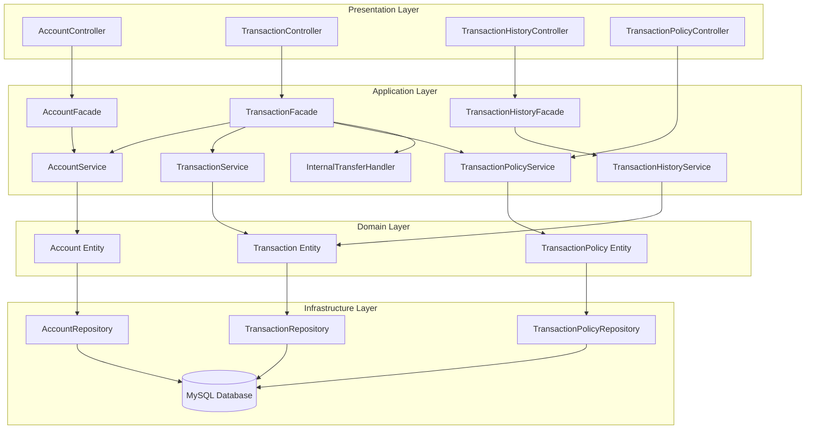
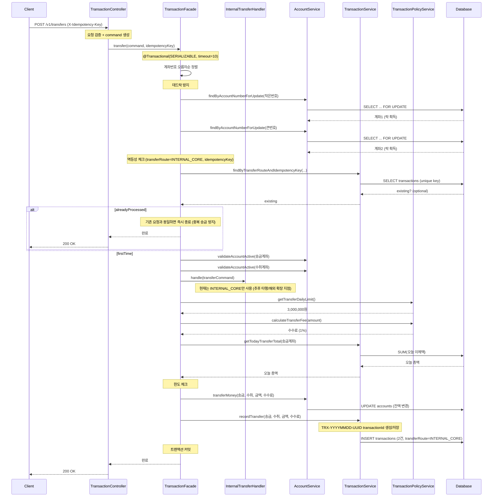
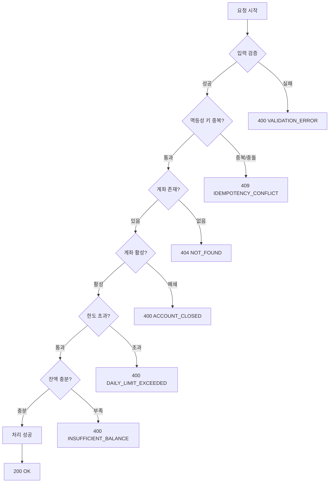

# 시스템 플로우 차트

## 목차

1. 전체 시스템 아키텍처
2. 이체 처리 플로우
3. 에러 처리 플로우
4. 주요 설계 포인트

## 1. 전체 시스템 아키텍처

---

## 2. 이체 처리 플로우

---

## 3. 에러 처리 플로우

---

## 4. 주요 설계 포인트

### 1. Facade 패턴
- **목적**: 여러 서비스를 조합한 복잡한 비즈니스 로직 처리
- **장점**: Service는 단일 책임만 가지고, Facade가 오케스트레이션 담당

### 2. 비관적 락 (Pessimistic Lock)
- **방식**: `@Lock(LockModeType.PESSIMISTIC_WRITE)`
- **이유**: 동시성 환경에서 데이터 일관성 보장

### 3. 데드락 방지
- **전략**: 계좌번호 오름차순 정렬 후 락 획득
- **효과**: 순환 대기 조건 제거

### 4. 트랜잭션 타임아웃
- **설정**: `@Transactional(timeout = 10)`
- **목적**: 무한 대기 방지, 장애 전파 차단

### 5. 격리 수준
- **설정**: `Isolation.SERIALIZABLE`
- **이유**: 최고 수준의 데이터 일관성 보장
