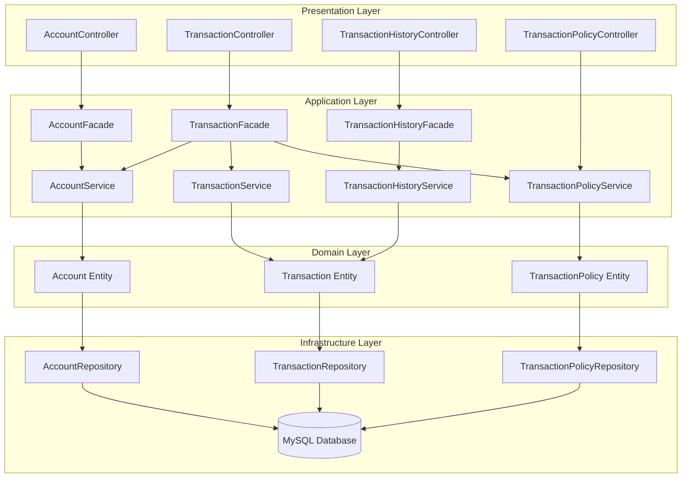
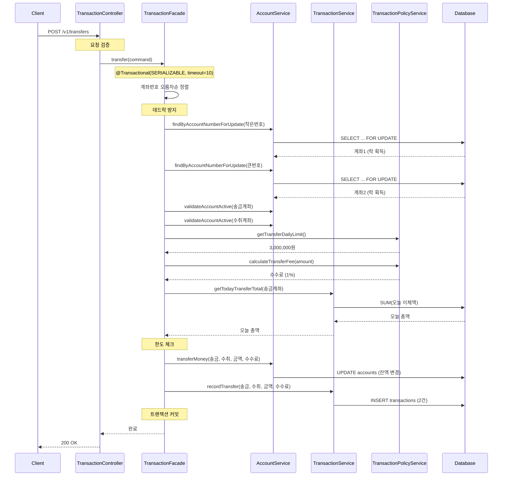
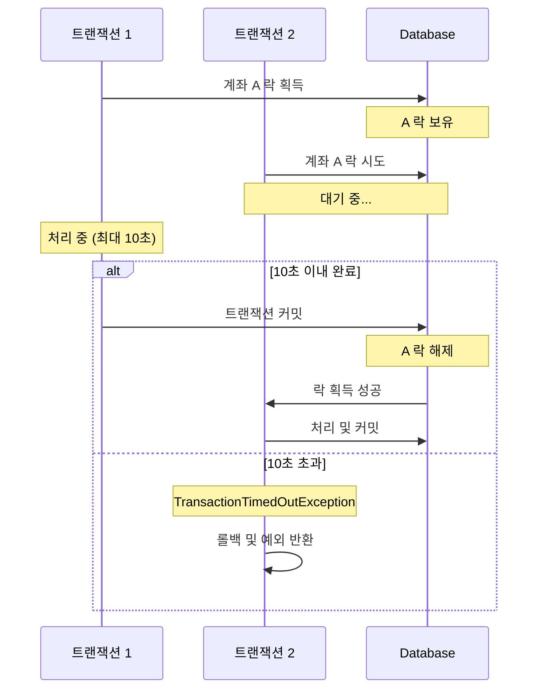
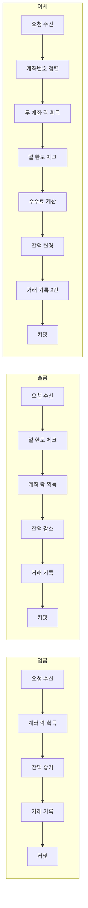
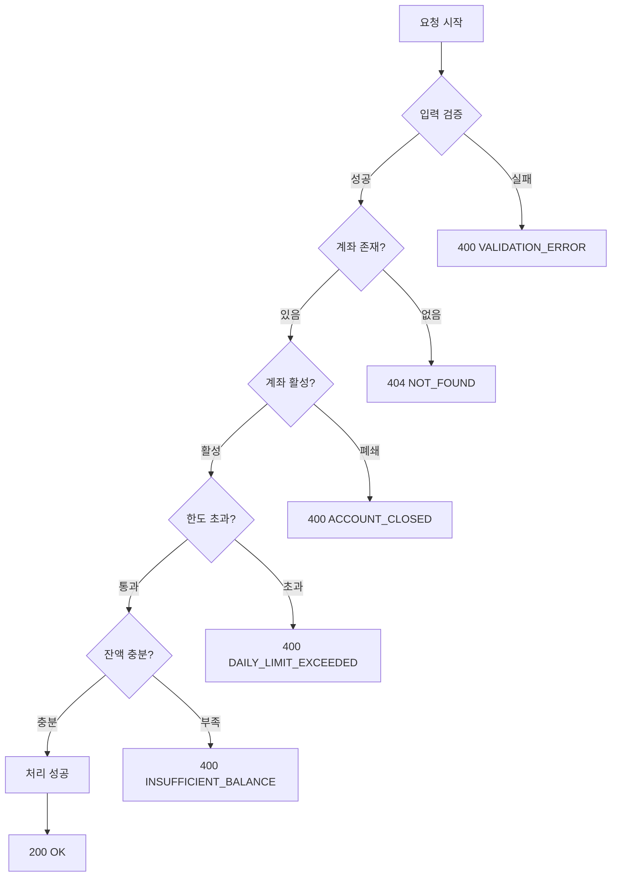

# 시스템 플로우 차트

## 1. 전체 시스템 아키텍처

---

## 2. 이체 처리 플로우

---

## 3. 동시성 제어 플로우

### 데드락 방지 메커니즘

```mermaid
graph TB
    subgraph scenario1 [시나리오: A→B 이체]
        T1Start[트랜잭션 1 시작]
        T1Compare[계좌번호 비교<br/>A vs B]
        T1LockA[A 계좌 락 획득]
        T1LockB[B 계좌 락 획득]
        T1Process[이체 처리]
        T1Commit[커밋]
        
        T1Start --> T1Compare
        T1Compare -->|A < B| T1LockA
        T1LockA --> T1LockB
        T1LockB --> T1Process
        T1Process --> T1Commit
    end
    
    subgraph scenario2 [시나리오: B→A 이체]
        T2Start[트랜잭션 2 시작]
        T2Compare[계좌번호 비교<br/>B vs A]
        T2LockA[A 계좌 락 획득]
        T2LockB[B 계좌 락 획득]
        T2Process[이체 처리]
        T2Commit[커밋]
        
        T2Start --> T2Compare
        T2Compare -->|A < B| T2LockA
        T2LockA --> T2LockB
        T2LockB --> T2Process
        T2Process --> T2Commit
    end
    
    style T1LockA fill:#e1f5e1
    style T2LockA fill:#e1f5e1
    style T1LockB fill:#fff3cd
    style T2LockB fill:#fff3cd
```

**핵심 원리**: 모든 트랜잭션이 **동일한 순서**(계좌번호 오름차순)로 락을 획득하므로 순환 대기가 발생하지 않음

### 락 타임아웃 처리

---

## 4. 거래 타입별 처리 플로우 비교

### 특징 비교

| 구분 | 입금 | 출금 | 이체 |
|-----|------|------|------|
| 락 대상 | 1개 계좌 | 1개 계좌 | 2개 계좌 (순서 보장) |
| 한도 체크 | 없음 | 일 1,000,000원 | 일 3,000,000원 |
| 수수료 | 없음 | 없음 | 1% (BPS 100) |
| 거래 기록 | 1건 | 1건 | 2건 (송금/수취) |
| 격리 수준 | SERIALIZABLE | SERIALIZABLE | SERIALIZABLE |
| 타임아웃 | 10초 | 10초 | 10초 |

---

## 5. 데이터 흐름도

### 이체 데이터 흐름

```mermaid
graph LR
    Request[이체 요청]
    Validate[입력 검증]
    Sort[계좌번호 정렬]
    Lock1[계좌1 락]
    Lock2[계좌2 락]
    CheckStatus[상태 검증]
    GetPolicy[정책 조회]
    CheckLimit[한도 체크]
    CalcFee[수수료 계산]
    UpdateBalance[잔액 변경]
    RecordTx[거래 기록]
    Commit[커밋]
    Response[응답]
    
    Request --> Validate
    Validate --> Sort
    Sort --> Lock1
    Lock1 --> Lock2
    Lock2 --> CheckStatus
    CheckStatus --> GetPolicy
    GetPolicy --> CheckLimit
    CheckLimit --> CalcFee
    CalcFee --> UpdateBalance
    UpdateBalance --> RecordTx
    RecordTx --> Commit
    Commit --> Response
    
    style Request fill:#e3f2fd
    style Response fill:#e8f5e9
    style Lock1 fill:#fff3cd
    style Lock2 fill:#fff3cd
    style Commit fill:#f3e5f5
```

---

## 6. 에러 처리 플로우

---

## 주요 설계 포인트

### 1. Facade 패턴
- **목적**: 여러 서비스를 조합한 복잡한 비즈니스 로직 처리
- **장점**: Service는 단일 책임만 가지고, Facade가 오케스트레이션 담당

### 2. 비관적 락 (Pessimistic Lock)
- **방식**: `@Lock(LockModeType.PESSIMISTIC_WRITE)`
- **이유**: 동시성 환경에서 데이터 일관성 보장

### 3. 데드락 방지
- **전략**: 계좌번호 오름차순 정렬 후 락 획득
- **효과**: 순환 대기 조건 제거

### 4. 트랜잭션 타임아웃
- **설정**: `@Transactional(timeout = 10)`
- **목적**: 무한 대기 방지, 장애 전파 차단

### 5. 격리 수준
- **설정**: `Isolation.SERIALIZABLE`
- **이유**: 최고 수준의 데이터 일관성 보장
